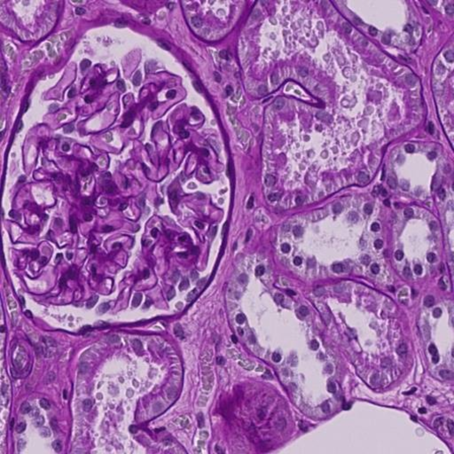
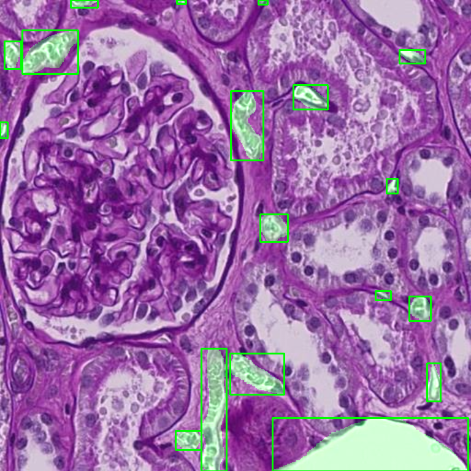
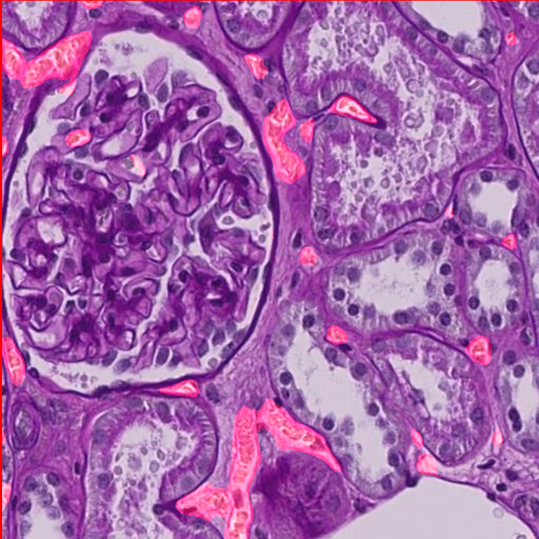
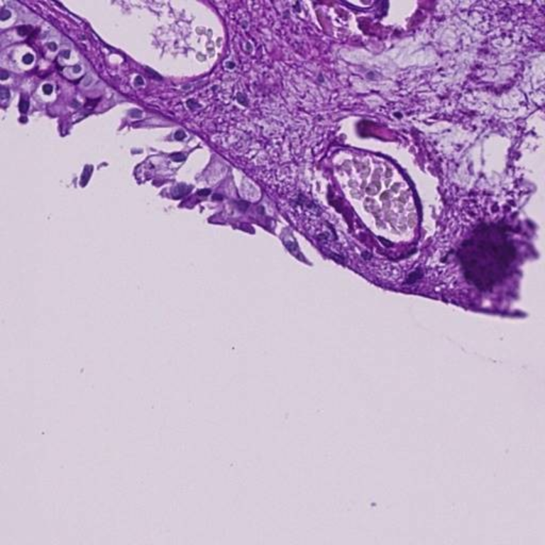
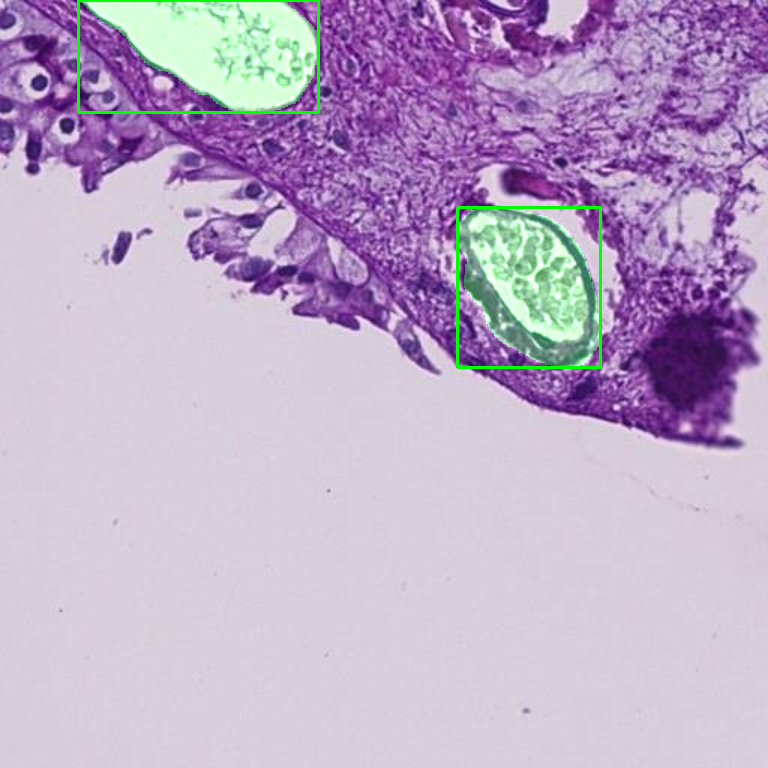
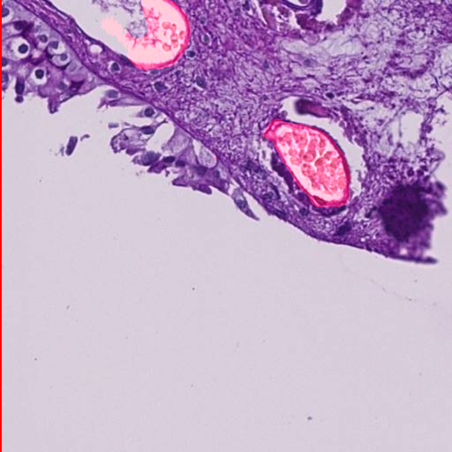
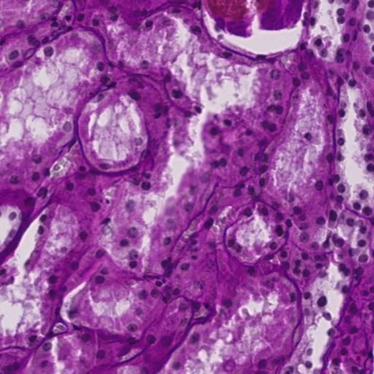
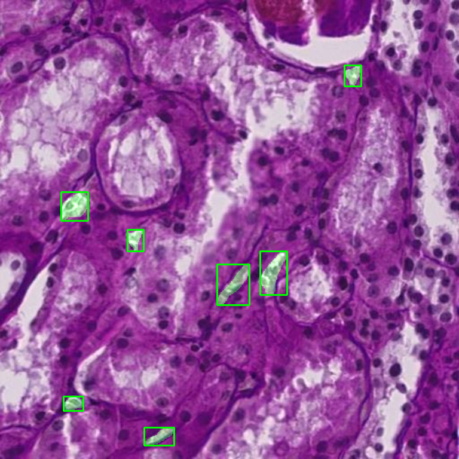
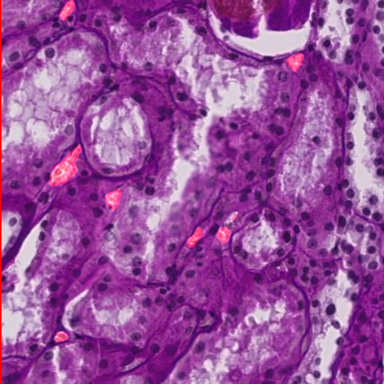

# Blood Vessel Segmentation & Detection 🩸

## 1. Project Overview
This project tackles the **HuBMAP - Hacking the Human Vasculature** challenge. The goal is to build a deep learning model capable of mapping the human vasculature system (blood vessels) using highly detailed microvascular images. 

Properly identifying blood vessels in tissue samples is critical for understanding how diseases (like kidney disease or cancer) progress. This project automates that process using a custom Multi-Task Deep Learning architecture that simultaneously draws bounding boxes around vessels and highlights their exact pixel boundaries.

---

## 2. Input and Output
To make predictions, the model needs medical imaging data, and it outputs two distinct types of localization data.

* **What we provide (Input):** 768x768 pixel `.tif` microscopic images of human tissue.
* **What it predicts (Output 1 - Detection):** Bounding box coordinates `[x_min, y_min, x_max, y_max]` locating the general area of every blood vessel in the image.
* **What it predicts (Output 2 - Segmentation):** A pixel-perfect binary mask where `1` represents a blood vessel and `0` represents background tissue.

---

## 3. Model Architecture
Instead of using an off-the-shelf model, this project utilizes a **Custom Dual-Head Attention Network**. It shares a main "brain" (encoder) to extract features, then splits into two specialized pathways.

* **Encoder (The Feature Extractor):** We use a **ConvNeXt-Tiny** backbone pre-trained on ImageNet. ConvNeXt provides state-of-the-art feature extraction, outperforming traditional ResNets while remaining highly efficient.
* **Detection Head (Bounding Boxes):** A lightweight feed-forward neural network that takes global features from the encoder and outputs 4 precise coordinates for vessel bounding boxes.
* **Segmentation Head (Pixel Masks):** A deep decoder pathway that rebuilds the image resolution. It uses **Attention Gates** to focus on intricate, tiny blood vessels while ignoring background noise, outputting the final visual mask.

---

## 4. Training Strategy & Optimizations
Training on high-resolution 768x768 medical images requires heavy compute. To train efficiently on limited hardware (like a 16GB Kaggle T4 GPU), we implemented advanced PyTorch optimizations:

* **Automatic Mixed Precision (AMP):** Utilizes 16-bit precision to cut memory usage in half and utilize hardware Tensor Cores, accelerating training by 1.5x to 2x.
* **Gradient Accumulation:** Accumulates gradients over 4 steps, simulating a batch size of 16 while physically only loading 4 images at a time to prevent Out of Memory (OOM) crashes.
* **Multi-Task Loss Function:** Combines Focal Loss, Tversky Loss (for handling class imbalance in masks), and Generalized IoU Loss (for bounding boxes) to ensure both heads learn synergistically.

---

## 5. Results & Visual Predictions
The model was evaluated on a strict 15% holdout validation set. We measure success using two standard medical imaging metrics:

* **Dice Score:** `[Insert Score, e.g., 0.85]` — Measures the pixel-perfect overlap between the prediction and ground truth.
* **IoU Score:** `[Insert Score, e.g., 0.76]` — Intersection over Union; evaluates the accuracy of the bounding boxes and masks.

### Visualizing Model Performance
Below are examples of how the model performs on unseen test data. For each example, you can see the **Initial** (raw tissue sample), the **Actual** (expert-annotated ground truth), and our **Predicted** (the model's automated segmentation and bounding boxes).

**Example 1: Complex Vasculature Structure**
*In this example, the model successfully identifies deeply embedded microscopic vessels. Notice how the predicted mask closely maps the intricate branches of the actual ground truth, while the bounding boxes correctly isolate the critical regions.*

| Initial (Raw Image) | Actual (Ground Truth) | Predicted (Model Output) |
| :---: | :---: | :---: |
|  |  |  |

**Example 2: Sparse Vasculature Detection**
*Here, the tissue sample has fewer, highly localized vessels. The model avoids false positives in the noisy background tissue and accurately pinpoints the isolated blood vessels, demonstrating high precision.*

| Initial (Raw Image) | Actual (Ground Truth) | Predicted (Model Output) |
| :---: | :---: | :---: |
|  |  |  |

**Example 3: Small Vessel Identification**
*This sample showcases the model's ability to detect and segment incredibly small, dispersed vessels across a wide area of tissue without losing granularity.*

| Initial (Raw Image) | Actual (Ground Truth) | Predicted (Model Output) |
| :---: | :---: | :---: |
|  |  |  |

---

## 6. Repository Structure
Here is how the project files are organized. Keeping the architecture modular makes it easier to test and scale.

    ├── data/                            # Local directory for downloaded Kaggle data
    ├── docs/                            # Folder for README images and documentation
    │   ├── initial_1.png
    │   ├── actual_1.png
    │   ├── predicted_1.png
    │   ├── initial_2.png
    │   ├── actual_2.png
    │   ├── predicted_2.png
    │   ├── initial_3.png
    │   ├── actual_3.png
    │   └── predicted_3.png
    ├── src/                             # Main source code directory
    │   ├── data/
    │   │   └── dataset.py               # Dataset class, augmentations, and collate_fn
    │   ├── models/
    │   │   └── architecture.py          # ConvNeXt Backbone, Attention Gates, Decoder
    │   └── utils/
    │       └── losses.py                # Multi-task loss functions and metric calculations
    ├── weights/                         # Saved .pth model weights
    ├── train.py                         # Main training loop with AMP and Gradient Accumulation
    ├── test.py                          # Evaluation script to calculate Dice/IoU scores
    ├── inference.py                     # Script to generate visual predictions on new images
    ├── requirements.txt                 # Python dependencies
    └── README.md                        # Project documentation

---

## 7. How to Run the Code

**1. Clone the repository and install dependencies:**
    git clone https://github.com/yourusername/blood-vessel-segmentation.git
    cd blood-vessel-segmentation
    pip install -r requirements.txt

**2. Train the model:**
Runs the training loop with AMP and Gradient Accumulation, saving the best weights to the `weights/` folder.
    python train.py

**3. Evaluate the model:**
Calculates the quantitative Dice and IoU scores on the validation set using saved weights.
    python test.py

**4. Generate visual predictions:**
Runs inference on unseen images and saves the visual mask comparisons.
    python inference.pys to the `docs/` folder.
    python inference.py
